# Solomon Ngwu (Kachi)

### Backend Engineer · Data Scientist · AI/ML Engineer

**Backend Systems · Data · AI/ML · Healthcare Technology**

Building practical software at the intersection of **engineering, data, and healthcare**.

 

&nbsp;

---

## 👨🏾‍💻 About Me

I'm a **backend engineer, data scientist, and AI/ML engineer** working primarily with **Python and Go**, with experience building applications with **C#/.NET** and working with data using **R**.

My interests span **backend engineering, data science, machine learning, AI, and healthcare technology**.

I enjoy turning **real-world problems, domain knowledge, and data into practical software solutions**.

---

## 🛠️ Tech Stack

<table>
<tr>
<td width="50%" valign="top">

### Languages

  

**Python** · **Go** · **C#** · **R**

</td>

<td width="50%" valign="top">

### Backend & Web

  

**Django** · **Flask** · **FastAPI**  
**ASP.NET Core** · **Entity Framework**  
**Go Standard Library** · **Chi** · **Gin**

</td>
</tr>

<tr>
<td width="50%" valign="top">

### Data Science & AI/ML

  

**NumPy** · **pandas** · **scikit-learn**  
**PyTorch** · **TensorFlow**  
**Jupyter** · **Google Colab**

</td>

<td width="50%" valign="top">

### Databases & Infrastructure

  

**PostgreSQL** · **Docker**  
**REST APIs** · **Git** · **GitHub**

</td>
</tr>

<tr>
<td colspan="2" align="center">

### Development Environment

</td>
</tr>

</table>

---

## 🚀 What I Build

<table>
<tr>

<td width="50%" valign="top">

### 🔌 Backend Systems

- RESTful APIs
- Web services
- Database-driven applications
- Authentication & authorization
- Healthcare APIs

</td>

<td width="50%" valign="top">

### 🤖 Data & AI

- Data analysis
- Predictive modelling
- Machine learning
- AI applications
- Decision-support systems

</td>

</tr>

<tr>

<td width="50%" valign="top">

### 🏥 Healthcare Technology

- Health records
- Pharmacy systems
- Healthcare workflows
- Adverse drug reaction reporting
- Healthcare data systems

</td>

<td width="50%" valign="top">

### 🧬 Applied Research

- Computational drug discovery
- Drug-response modelling
- Healthcare analytics
- Data-driven healthcare
- Domain-informed ML applications

</td>

</tr>
</table>

---

## 🔨 Currently Building

### 🏥 MiraMed

**An online pharmacy marketplace with adverse drug reaction reporting,  
built with Go and PostgreSQL.**

 

`Go` · `Chi` · `PostgreSQL` · `Docker`

  

🔒 **Private repository · Currently under development**

---

## 🧠 Current Focus

<table align="center">

<tr>

<td align="center" width="33%">

### Backend Engineering

Go & Python

APIs & Web Services

PostgreSQL

System Design

</td>

<td align="center" width="33%">

### Data & AI

Data Analysis

Machine Learning

Predictive Modelling

AI Applications

</td>

<td align="center" width="33%">

### Healthcare Technology

Healthcare APIs

Health Records

Computational Drug Discovery

Data-Driven Healthcare

</td>

</tr>

</table>

---

## 📊 GitHub Activity

 

---

## 🐍 Contribution Graph

<picture>
  <source
    media="(prefers-color-scheme: dark)"
    srcset="https://raw.githubusercontent.com/Khatchi/Khatchi/output/github-contribution-grid-snake-dark.svg"
  />

  <source
    media="(prefers-color-scheme: light)"
    srcset="https://raw.githubusercontent.com/Khatchi/Khatchi/output/github-contribution-grid-snake.svg"
  />

  

</picture>

---

### Building systems. Working with data. Applying AI to real-world problems.

